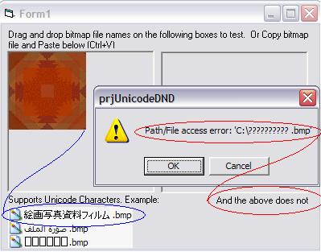



## FYI: Drag n Drop Unicode FileNames

### Description

Add unicode filename support to VB when dropping files or pasting files. Making attempts to understand unicode support, I am discovering some shortfalls within VB. And in this specific case have not found a workaround for the problem so I thought I'd post my attempts. The problem can be experienced when a file name or path name has unicode characters (see screenshot). Unicode support is rather new to me and I am learning as I go. I think this mini-project may help others too. 23Apr07: Removed TLB requirement; no TLB used. 23Apr07: Found logic error. Assumed AddRef was being called by DispCallFunc but it was not; therefore, fixed error that would be calling Release when it shouldn't which could crash IDE.
 
### More Info
 

             |
---                |---
**Submitted On**   |2007-04-23 19:19:12
**By**             |[LaVolpe](https://github.com/Planet-Source-Code/PSCIndex/blob/master/ByAuthor/lavolpe.md)
**Level**          |Advanced
**User Rating**    |5.0 (25 globes from 5 users)
**Compatibility**  |VB 6\.0
**Category**       |[Miscellaneous](https://github.com/Planet-Source-Code/PSCIndex/blob/master/ByCategory/miscellaneous__1-1.md)
**World**          |[Visual Basic](https://github.com/Planet-Source-Code/PSCIndex/blob/master/ByWorld/visual-basic.md)
**Archive File**   |[FYI\_\_Drag\_2061894232007\.zip](https://github.com/Planet-Source-Code/lavolpe-fyi-drag-n-drop-unicode-filenames__1-68408/archive/master.zip)

